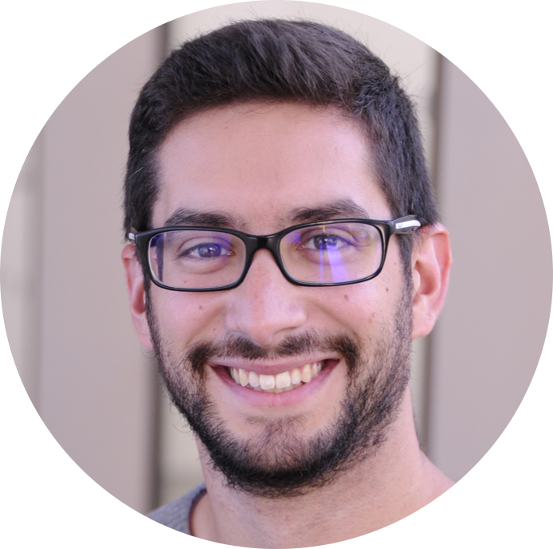

# About me 👋

I'm a scientist, currently working as a postdoctoral researcher at the [Systems and Population Genetics Group](https://odelaneau.github.io/lap-page/) at the University of Lausanne, Switzerland.
I'm leading a [research project funded by the European Commission](https://cordis.europa.eu/project/id/885998/) centered on understanding why genes close to each other are often found co-expressed and what are the molecular and disease-state repercussions of this co-expression.
In 2018, I obtained a PhD in Bioinformatics and Genomics from the University of Aix-Marseille (France) while working at the [TAGC](https://tagc.univ-amu.fr/) unit, an INSERM laboratory, under the supervision of Dr. Christine Brun. During my PhD, I gained expertise in network biology, functional genomics and analysing big data, as well as technical skills such as programming and creating scientific databases (e.g. [MoonDB](http://moondb.hb.univ-amu.fr/)).
## Interests 💭
- Genetics & Evolution
- Functional genomics
- High-throughput technologies 
- Machine learning & Scientific programming

***

# Experience & Education 🎓
## Postdoctoral researcher (2019-present)
- **Where:** [Department of Computational Biology](https://www.unil.ch/dbc/en/home.html), University of Lausanne, Switzerland
- **Project:** [Marie-Curie Postdoctoral Research Fellow](https://cordis.europa.eu/project/id/885998), leading a project on studying the effect of genetic variants in gene expression, complex traits and diseases
- **Supervisor:** Olivier Delaneau ([Systems and Population Genetics Group](https://odelaneau.github.io/lap-page/))
- **Keywords:** human genetics, genetic variations, gene expression, eQTL analysis, GWAS
- **Master student co-supervision:** Yami Arizmendi: *Molecular features impacting local gene co-expression* (first year)
- **Teaching:** Python practicals to Bachelor students
## PhD in Bioinformatics (2015-2018)
- **Where:** [Aix-Marseille University](https://www.univ-amu.fr/en), France. Carried out at the [TAGC](https://tagc.univ-amu.fr/) laboratory, [INSERM](https://www.inserm.fr/en), France.
- **Thesis title:** Discovery of the role of protein-RNA interactions in protein multifunctionality and cellular complexity
- **Supervisors:** Christine Brun (TAGC, Marseille, France), Gian Gaetano Tartaglia (CRG, Barcelona, Spain)
- **Keywords:** protein-RNA interactions, network biology, protein multifunctionality, 3’UTR and lncRNA function, database development
- **Master student co-supervision:** Adrien Teixeira (first year): *Predicting 3’UTRs scaffolding protein complexes*, Paul De Boissier (first year): *Large-scale inference of small ORF interactions* 
- **Teaching:** Bioinformatics (70h practicals, 3rd year Bachelor students), Informatics for biology (58h practicals, 1st year Bachelor students)
## Bioinformatician (2014-2015)
- **Where:** [Wellcome Sanger Institute](https://www.sanger.ac.uk/), Cambridge, UK
- **Supervisors:** Matthew Berriman, Avril Coghlan (Parasite Genomics group)
- **Keywords:** comparative genomics, de novo genome assembly, gene discovery, gene function annotation, SNP calling, parasitism
## Bioinformatician (2012-2013)
- **Where:**[Instituto Gulbenkian de Ciência (IGC)](https://gulbenkian.pt/ciencia/), Portugal
- **Supervisor:** Alekos Athanasiadis (Protein-Nucleic Acid Interactions group)
- **Keywords:** RNA editing, machine learning, genetic algorithms, evolution
## Master of Science (2010-2012)
- **Where:** [Master in Bioinformatics and Computational Biology](https://fenix.ciencias.ulisboa.pt/degrees/bioinformatica-e-biologia-computacional-564500436615187), University of Lisbon, Portugal
- **Thesis title:** *Studies on the Influence of A to I RNA Editing on Protein Evolution*, carried out at IGC, Portugal
## Bachelor in Biology (2006-2010)
- **Where:** [Universidade Lusófona](https://www.ulusofona.pt/), Lisbon, Portugal. 
***
# Publications 📜
- [Google scholar](https://scholar.google.fr/citations?user=RQef1JgAAAAJ&hl=en&oi=sra)
## First-author publications
- one
- two

## Co-author publications
- one
- two
***
# Contact 🌍
- 🏢 Genopode, UNIL-Sorge, Lausanne, Vaud, 1015
- ✉️ <diogo.am.ribeiro@gmail.com>
- [Twitter](https://twitter.com/Diogo_M_Ribeiro)
- [LinkedIN](https://www.linkedin.com/in/diogo-ribeiro-783b4526/)	

***

  <footer class="site-footer">
  
  

    © 2020. All rights reserved.
  

  </footer>

