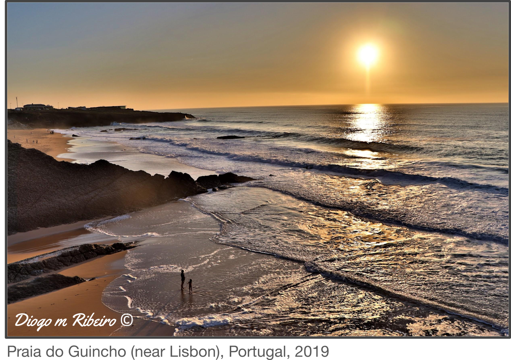

# About me 👋
I'm a scientist, with 5 years experience as a postdoctoral researcher at the [Systems and Population Genetics Group](https://odelaneau.github.io/lap-page/) at the University of Lausanne, Switzerland.
I have led a [research project funded by the European Commission](https://cordis.europa.eu/project/id/885998/) centered on understanding why neighbouring genes are often found co-expressed and what are the molecular and disease-state repercussions of this co-expression.
In 2018, I obtained a PhD in Bioinformatics and Genomics from the Aix-Marseille University (France) while working at the [TAGC](https://tagc.univ-amu.fr/) unit, under the supervision of Dr. Christine Brun. Prior to my PhD, I worked as bioinformatician in renowned research institutes ([Sanger Institute](https://www.sanger.ac.uk/), UK & [Instituto Gulbenkian de Ciência](https://gulbenkian.pt/ciencia/), Portugal).  

I have solid experience in functional genomics and analysing big data (e.g. UK Biobank whole genome sequencing on 500k samples), as well as technical skills such as programming and creating scientific databases (e.g. [MoonDB](http://moondb.hb.univ-amu.fr/), [LoCOP](https://glcoex.unil.ch/)). As a main author of several peer-reviewed publications, I have good experience in writing scientific articles, as well as research grants. I have worked both independently and as part of a team, including supervising students.  

In my free time you will find me immersed in nature, exploring all the possible trails, only stopping for some bird watching. Currently, I'm enjoy hiking in the lovely Swiss Alps. When the weather takes me indoors, I enjoy playing guitar and tennis.

## Interests 💭
My interests are broad and mixed between the understanding of fundamental biology and leveraging computational and technological advances to answer biological questions.
- Genetics & Evolution
- Functional genomics & RNA biology
- High-throughput technologies (e.g. sequencing, multi-omics)
- Machine learning & scientific programming

***

# Experience & Education 🎓
## Postdoctoral researcher (2019-2024)
- **Where:** [Department of Computational Biology](https://www.unil.ch/dbc/en/home.html), University of Lausanne, Switzerland
- **Project:** [Marie-Curie Postdoctoral Research Fellow](https://cordis.europa.eu/project/id/885998), leading a project on studying the effect of genetic variants in gene expression, complex traits and diseases
- **Supervisor:** Olivier Delaneau ([Systems and Population Genetics Group](https://odelaneau.github.io/lap-page/))
- **Keywords:** human genetics, genetic variations, gene expression, eQTL analysis, GWAS
- **Internship student supervision:** Chaymae Ziyani: *Exploring gene expression regulation by enhancers through single cell analysis* 
- **Master student co-supervision:** Yami Arizmendi: *Molecular features impacting local gene co-expression* 
- **Teaching:** Python practicals, Biostatistics with R (Bachelor level) / Gene expression, eQTL and GWAS analysis (Master level) 

## PhD in Bioinformatics (2015-2018)
- **Where:** [Aix-Marseille University](https://www.univ-amu.fr/en), France. Carried out at the [TAGC](https://tagc.univ-amu.fr/) laboratory, [INSERM](https://www.inserm.fr/en), France.
- **Thesis title:** Discovery of the role of protein-RNA interactions in protein multifunctionality and cellular complexity
- **Supervisors:** Christine Brun (TAGC, Marseille, France), Gian Gaetano Tartaglia (CRG, Barcelona, Spain)
- **Keywords:** protein-RNA interactions, network biology, protein multifunctionality, 3’UTR and lncRNA function, database development
- **Master student co-supervision:** Adrien Teixeira (first year): *Predicting 3’UTRs scaffolding protein complexes*, Paul De Boissier (first year): *Large-scale inference of small ORF interactions* 
- **Teaching:** Bioinformatics (3rd year Bachelor students), Informatics for biology (1st year Bachelor students)  

## Bioinformatician (2014-2015)
- **Where:** [Wellcome Sanger Institute](https://www.sanger.ac.uk/), Cambridge, UK
- **Supervisors:** Matthew Berriman, Avril Coghlan (Parasite Genomics group)
- **Keywords:** comparative genomics, de novo genome assembly, gene discovery, gene function annotation, SNP calling, parasitism

## Bioinformatician (2012-2013)
- **Where:**[Instituto Gulbenkian de Ciência (IGC)](https://gulbenkian.pt/ciencia/), Oeiras, Portugal
- **Supervisor:** Alekos Athanasiadis (Protein-Nucleic Acid Interactions group)
- **Keywords:** RNA editing, machine learning, genetic algorithms, evolution

## Master in Bioinformatics (2010-2012)
- **Where:** [University of Lisbon](https://www.ulisboa.pt/en), Portugal
- **Thesis title:** *Studies on the Influence of A to I RNA Editing on Protein Evolution*, carried out at IGC, Portugal

## Bachelor in Biology (2006-2010)
- **Where:** [Universidade Lusófona](https://www.ulusofona.pt/), Lisbon, Portugal

***
# Publications 📜

 <a href="https://scholar.google.fr/citations?user=RQef1JgAAAAJ&hl=en&oi=sra">See publications on Google scholar</a>

## First-author publications
1. **Ribeiro DM**, Delaneau O. (2023) [Non-coding rare variant associations with blood traits on 166,740 UK Biobank genomes.](https://www.biorxiv.org/content/10.1101/2023.12.01.569422v1.abstract) <ins>BioRxiv</ins>.
💬 *Exploiting the 200k whole genome sequences from the UK Biobank identify rare variants associated to >50 blood traits, leveraging genomic information linking genes to regulatory regions.*
1. Hofmeister R\*, **Ribeiro DM\***, Rubinacci S\*, Delaneau O. (2023) [Accurate rare variant phasing of whole-genome and whole-exome sequencing data in the UK Biobank.]([https://www.nature.com/ng/](https://www.nature.com/articles/s41588-023-01415-w)) <ins>Nature Genetics</ins>.  (\*co-first authors)
💬 *Phasing of the UK Biobank WGS and WES data for ~150K individuals using SHAPEIT5. I participated in phasing quality-control and identifying compound heterozygous genes, showing that these are depleted for essential genes.*
1. **Ribeiro DM**, Ziyani C, Delaneau O. (2022) [Shared regulation and functional relevance of local gene co-expression revealed by single cell analysis.](https://www.nature.com/articles/s42003-022-03831-w) <ins>Communications Biology</ins>.  
💬 *Work using single cell data to measure gene co-expression, comparing bulk and single cell-derived co-expressed gene pairs. Exploiting multimodal single cell data (SHARE-seq data) to link thousands of co-active genes and enhancers, showing that co-expressed genes often share the same enhancers.*
1. **Ribeiro DM**, Rubinacci S, Ramisch A, Hofmeister RJ, Dermitzakis ET, Delaneau O. (2021) [The molecular basis, genetic control and pleiotropic effects of local gene co-expression.](https://www.nature.com/articles/s41467-021-25129-x) <ins>Nature Communications</ins>.  
💬 *This work describes a novel approach to identify neighbouring genes that are co-expressed with each other across 49 human tissues, by levaraging RNA-seq datasets performed on hundreds of individuals (i.e. GTEx). As gene co-expression can stem from the genes having common regulatory elements, we identified thousands of genetic variants that are near to the co-expressed genes and may jointly affect their expression. Interestingly, these variants often overlapped enhancers and associated with multiple human traits and diseases. The main results of this study are available on [LoCOP DB](https://glcoex.unil.ch/).*
1. **Ribeiro DM**, Prod’homme A, Teixeira A, Zanzoni A, Brun C. (2020) [The role of 3′UTR-protein complexes in the regulation of protein multifunctionality and subcellular localization.](https://academic.oup.com/nar/advance-article/doi/10.1093/nar/gkaa462/5850311?searchresult=1) <ins>Nucleic Acids Research</ins>.  
💬 *This was the final publication stemming from my PhD work. In a very innovative approach, we combined protein-3'UTR and protein-protein interactions into a joint network and predicted the effect of 3'UTRs in affecting the protein cellular localization. This was based in a novel finding that during protein translation, 3'UTRs may facilitate the formation of protein complexes which affect the cellular localization of the nascent protein. For the first time, we predicted that this phenomenon may be common, particularly for proteins which perform multiple unrelated cellular functions (e.g. moonlighting proteins).*
1. **Ribeiro DM**, Briere G, Bely B, Spinelli L, Brun C. (2018) [MoonDB 2.0: an updated database of extreme multifunctional and moonlighting proteins.](https://academic.oup.com/nar/article/47/D1/D398/5146199) <ins>Nucleic Acids Research</ins>.  
💬 *In this work I developed a scientific database, [MoonDB 2.0](http://moondb.hb.univ-amu.fr/), a reiteration of a previous MoonDB database. This database contains computational predictions and manually curated multifunctional and moonlighting proteins, i.e. proteins which are  (often entirely unexpected) functions. This database includes proteins from Human, Mouse, Yeast, Drosophila and Worm reference species.*
1. **Ribeiro DM**, Zanzoni A, (...), Tartaglia GG, Brun C. (2018) [Protein complex scaffolding predicted as a prevalent function of long non-coding RNAs.](https://academic.oup.com/nar/article/46/2/917/4641912) <ins>Nucleic Acids Research</ins>.  
💬 *This was the first publication of my PhD work. This highly innovative work entailed a large-scale analysis of the largest protein-RNA interaction network at the time, an often understudied subject. The creation of such a large network was possible due to the use of catRAPID, a computational prediction software. We used this network to gain insights into the functional of lncRNAs (which is generally unknown), based on their association to proteins (for which we know the function).*
1. **Ribeiro DM**, Coghlan A, Harsha B, Berriman M. (2018) [Identification of lineage-specific gene family expansions in a database of gene families](https://protocolexchange.researchsquare.com/article/nprot-6681/v1). <ins>Protocol Exchange</ins> (not peer-reviewed)  
💬 *This is a protocol publication (not a research article) describing several metrics developed to identify gene family expansions in a lineage of species within a larger set of species. This protocol was used for the [50 Helminth Genomes Project](https://www.sanger.ac.uk/collaboration/50hgp/) at the Sanger Institute.*
## Last-author publications
1. Ziyani C, Delaneau O, **Ribeiro DM**. (2023) [Multimodal single cell analysis infers widespread enhancer co-activity in a lymphoblastoid cell line](https://www.nature.com/articles/s42003-023-04954-4) <ins>Communications Biology</ins>.
💬 *Pioneering work exploiting the multimodal single cell SHARE-seq dataset to identify enhancer-enhancer associations based on their co-activity across cells. Enhancers targeting the same gene are often co-active and have binding sites for the same transcription factors.*
## Co-authored publications
1. Avalos D, Rey G, **Ribeiro DM**, Ramisch A, Dermitzakis ET, Delaneau O. (2023) [Genetic variation in cis-regulatory domains suggests cell type-specific regulatory mechanisms in immunity](https://www.nature.com/articles/s42003-023-04688-3) <ins>Communications Biology</ins>.
1. Hofmeister RJ, Rubinacci S, **Ribeiro DM**, Buil A, Kutalik Z, Delaneau O. (2022) [Parent-of-Origin inference for biobanks](https://www.nature.com/articles/s41467-022-34383-6) <ins>Nature Communications</ins>.
1. Rubinacci S, **Ribeiro DM**, Hofmeister RJ, Delaneau O. (2021) [Efficient phasing and imputation of low-coverage sequencing data using large reference panels](https://www.nature.com/articles/s41588-020-00756-0) <ins>Nature Genetics</ins>.
1. Porcu E, (...), **Ribeiro DM**, (...), Kutalik Z. (2021) [Differentially expressed genes reflect disease-induced rather than disease-causing changes in the transcriptome](https://www.nature.com/articles/s41467-021-25805-y) <ins>Nature Communications</ins>.
1. Zanzoni A, **Ribeiro DM**, Brun C. (2019) [Understanding protein multifunctionality: from short linear motifs to cellular functions.](https://link.springer.com/article/10.1007/s00018-019-03273-4) <ins>Cellular and Molecular Life Sciences</ins>.(book chapter)  
1. Zanzoni A, Spinelli L, **Ribeiro DM**, Tartaglia GG, Brun C. (2019) [Post-transcriptional regulatory patterns revealed by protein-RNA interactions](https://www.nature.com/articles/s41598-019-40939-2). <ins>Scientific Reports</ins>.  
1. International Helminth Genomes Consortium. (2018) [Comparative genomics of the major parasitic worms](https://www.nature.com/articles/s41588-018-0262-1). <ins>Nature Genetics</ins>.  
1. Protasio AV, Dongen S, Collins J, Quintais L, **Ribeiro DM**, (...), Berriman m. (2017) [MiR-277/4989 regulate transcriptional landscape during juvenile to adult transition in the parasitic helminth Schistosoma mansoni.](https://journals.plos.org/plosntds/article?id=10.1371/journal.pntd.0005559) <ins>PLoS Negl Trop Dis</ins>.  
1. Hunt VL, Tsai IJ, (...), **Ribeiro DM**, (...), Berriman M. (2016) [The genomic basis of parasitism in the Strongyloides clade of nematodes](https://www.nature.com/articles/ng.3495). <ins>Nature Genetics</ins>.  
1. Bennett HM, Mok HP, (...), **Ribeiro DM**, (...), Berriman M. (2014) [The genome of the sparganosis tapeworm Spirometra erinaceieuropaei isolated from the biopsy of a migrating brain lesion](https://genomebiology.biomedcentral.com/articles/10.1186/s13059-014-0510-3). <ins>Genome Biology</ins>.  

***
# Awards & Funding
- **[Marie Skłodowska-Curie Actions Individual fellowship (MSCA-IF-2019)](https://cordis.europa.eu/project/id/885998)**. Funding: 203.149€ (2 years) 
- **[American Society for Human Genetics (ASHG) Epstein Trainee Awards for Excellence in Human Genetics Research](https://www.ashg.org/membership/awards/epstein/)** Semifinalist 2021, Postdoctoral category. Prize: $750

***
# Contact 🌍

🏢 Department of Computational Biology, Genopode, UNIL-Sorge, 1015 Lausanne, Switzerland

✉️ <diogo.am.ribeiro@gmail.com>

🐤 [Twitter](https://twitter.com/Diogo_M_Ribeiro)

🔗 [LinkedIN](https://www.linkedin.com/in/diogo-ribeiro-783b4526/)	

***

  <footer class="site-footer">  
  
© 2020. All rights reserved.

  </footer>

